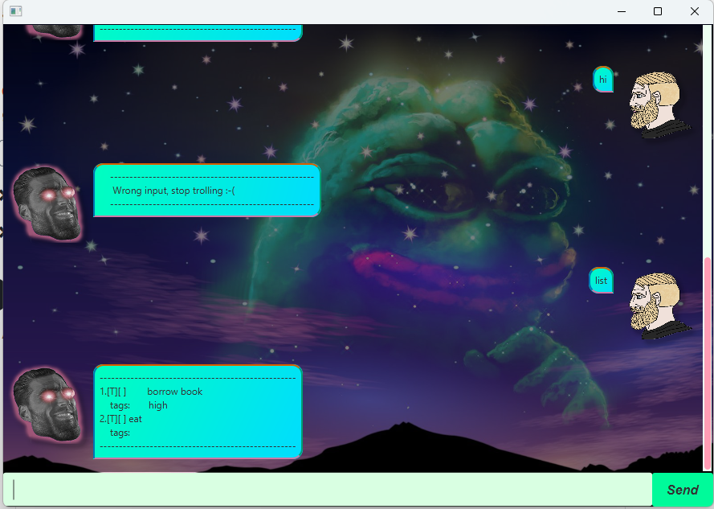

# John User Guide

---

Welcome to chatbot John's User Guide. John is a gigachad bot meant to help you plan your tasks. \
John never forgets your tasks and their deadlines. 



## Features

### Adding a todo: ```todo```
Adds a task with no timeline.

Format: `todo [taskName]`

---

### Adding a deadline: ```deadline```
Adds a task that has a deadline. 

Format: `deadline [taskName] by [dateTime dd/mm/yyyy HHmm]`

Example:

- `deadline Submit Assignment by 15/02/2025 2359`


---

### Adding an event: ```event```
Adds a task with start date and end date.

Format: `event [taskName] from [startDate dd/mm/yyyy HHmm] to [endDate dd/mm/yyy HHmm]`

Example:

- `event 2XU from 28/04/2025 0630 to 28/04/2025 0900`

---

### Adding tags : ```tag```
Adds a tag to a specific task.

Format: `tag [taskNumber] [tagDescription]`

Example:

- `tag 1 high`

---

### Listing tasks: ```list```
Lists out all tracked tasks.

Format: `list`

---

### Marking tasks: ```mark```
Marks a task as completed.

Format: `mark [taskNumber]`

Example: `mark 2`

---

### Unmarking tasks: ```unmark```
Unmarks a completed task.

Format: `unmark [taskNumber]`

Example: `unmark 2`

---

### Finding tasks: ```find```
Finds a task using substring

Format: `find [subString]`

Example:

- `find book`


---

### Exit programme: ```bye```
Closes the chatbot.

